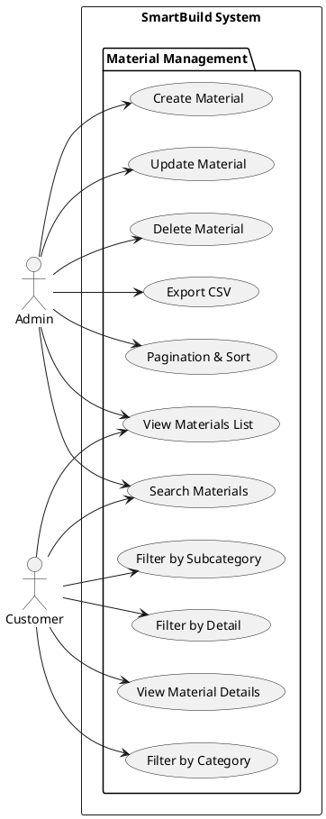
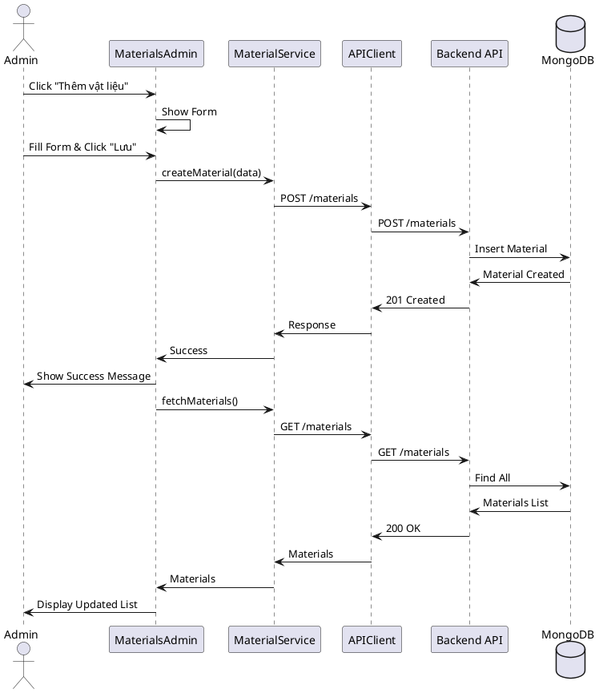
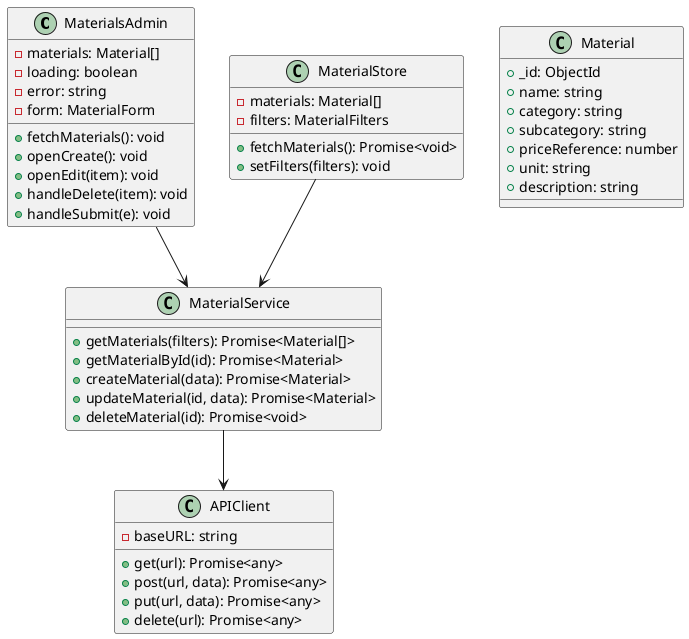
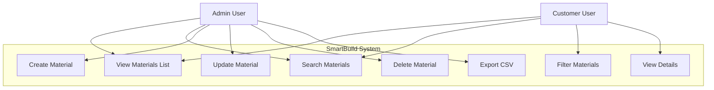
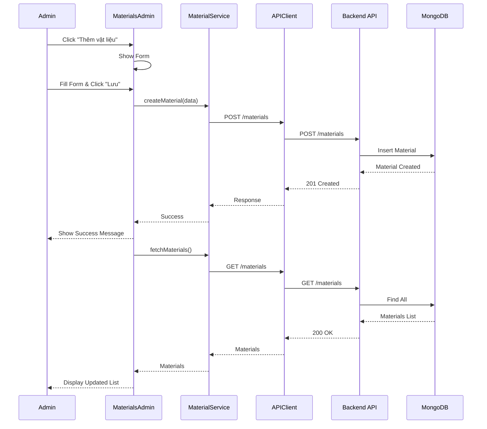

# Hướng Dẫn Vẽ Các Diagram Cho Chức Năng CRUD Sản Phẩm (Vật Liệu Xây Dựng)
## SmartBuild - MERN Stack Application

---

## 📋 Mục Lục
1. [Use Case Diagram](#1-use-case-diagram)
2. [Sequence Diagram](#2-sequence-diagram)
3. [Class Diagram](#3-class-diagram)
4. [System Context Diagram](#4-system-context-diagram)
5. [Software System Context Diagram](#5-software-system-context-diagram)

---

## 1. Use Case Diagram

### 1.1. Actors (Người dùng)
- **Admin**: Quản trị viên hệ thống
- **Customer**: Khách hàng (người dùng thông thường)
- **System**: Hệ thống (tự động)

### 1.2. Use Cases

#### Admin Use Cases:
- **UC-001**: Quản lý vật liệu (Manage Materials)
  - **UC-001.1**: Xem danh sách vật liệu (View Materials List)
  - **UC-001.2**: Tìm kiếm vật liệu (Search Materials)
  - **UC-001.3**: Tạo vật liệu mới (Create Material)
  - **UC-001.4**: Cập nhật vật liệu (Update Material)
  - **UC-001.5**: Xóa vật liệu (Delete Material)
  - **UC-001.6**: Xuất dữ liệu CSV (Export CSV)
  - **UC-001.7**: Phân trang và sắp xếp (Pagination & Sort)

#### Customer Use Cases:
- **UC-002**: Xem vật liệu (View Materials)
  - **UC-002.1**: Xem danh sách vật liệu (View Materials List)
  - **UC-002.2**: Tìm kiếm vật liệu (Search Materials)
  - **UC-002.3**: Lọc theo danh mục (Filter by Category)
  - **UC-002.4**: Lọc theo phân loại (Filter by Subcategory)
  - **UC-002.5**: Lọc theo chi tiết (Filter by Detail)
  - **UC-002.6**: Xem chi tiết vật liệu (View Material Details)

### 1.3. Hướng Dẫn Vẽ Use Case Diagram

```
┌─────────────────────────────────────────────────────────────┐
│                    SmartBuild System                         │
│                                                              │
│  ┌────────────────────────────────────────────────────┐    │
│  │         Admin Use Cases                            │    │
│  │                                                     │    │
│  │  ┌──────────────────────────────────────────┐    │    │
│  │  │  UC-001: Quản lý vật liệu                │    │    │
│  │  │  ├─ UC-001.1: Xem danh sách              │    │    │
│  │  │  ├─ UC-001.2: Tìm kiếm                   │    │    │
│  │  │  ├─ UC-001.3: Tạo mới                    │    │    │
│  │  │  ├─ UC-001.4: Cập nhật                   │    │    │
│  │  │  ├─ UC-001.5: Xóa                        │    │    │
│  │  │  ├─ UC-001.6: Xuất CSV                  │    │    │
│  │  │  └─ UC-001.7: Phân trang & Sắp xếp      │    │    │
│  │  └──────────────────────────────────────────┘    │    │
│  └────────────────────────────────────────────────────┘    │
│                                                              │
│  ┌────────────────────────────────────────────────────┐    │
│  │         Customer Use Cases                        │    │
│  │                                                     │    │
│  │  ┌──────────────────────────────────────────┐    │    │
│  │  │  UC-002: Xem vật liệu                   │    │    │
│  │  │  ├─ UC-002.1: Xem danh sách             │    │    │
│  │  │  ├─ UC-002.2: Tìm kiếm                 │    │    │
│  │  │  ├─ UC-002.3: Lọc theo danh mục        │    │    │
│  │  │  ├─ UC-002.4: Lọc theo phân loại       │    │    │
│  │  │  ├─ UC-002.5: Lọc theo chi tiết        │    │    │
│  │  │  └─ UC-002.6: Xem chi tiết             │    │    │
│  │  └──────────────────────────────────────────┘    │    │
│  └────────────────────────────────────────────────────┘    │
│                                                              │
└─────────────────────────────────────────────────────────────┘
         │                              │
         │                              │
    ┌────▼────┐                   ┌────▼────┐
    │  Admin  │                   │Customer │
    └─────────┘                   └─────────┘
```

### 1.4. Mô Tả Chi Tiết Use Cases

#### UC-001.3: Tạo vật liệu mới
- **Actor**: Admin
- **Precondition**: Admin đã đăng nhập
- **Main Flow**:
  1. Admin click nút "Thêm vật liệu"
  2. Hệ thống hiển thị form tạo mới
  3. Admin nhập thông tin: tên, danh mục, phân loại, đơn giá, đơn vị, mô tả, ảnh
  4. Admin click "Lưu"
  5. Hệ thống validate dữ liệu
  6. Hệ thống lưu vào database
  7. Hệ thống hiển thị thông báo thành công
  8. Hệ thống cập nhật danh sách
- **Postcondition**: Vật liệu mới được tạo trong hệ thống

#### UC-001.4: Cập nhật vật liệu
- **Actor**: Admin
- **Precondition**: Admin đã đăng nhập, vật liệu tồn tại
- **Main Flow**:
  1. Admin click nút "Sửa" trên vật liệu
  2. Hệ thống hiển thị form với dữ liệu hiện tại
  3. Admin chỉnh sửa thông tin
  4. Admin click "Lưu"
  5. Hệ thống validate và cập nhật database
  6. Hệ thống hiển thị thông báo thành công
- **Postcondition**: Thông tin vật liệu được cập nhật

#### UC-001.5: Xóa vật liệu
- **Actor**: Admin
- **Precondition**: Admin đã đăng nhập, vật liệu tồn tại
- **Main Flow**:
  1. Admin click nút "Xóa"
  2. Hệ thống hiển thị dialog xác nhận
  3. Admin xác nhận xóa
  4. Hệ thống xóa vật liệu khỏi database
  5. Hệ thống cập nhật danh sách
- **Postcondition**: Vật liệu bị xóa khỏi hệ thống

---

## 2. Sequence Diagram

### 2.1. Create Material (Tạo vật liệu mới)

```
Admin          MaterialsAdmin      MaterialService      APIClient      Backend API      MongoDB
  │                  │                    │                 │                │               │
  │───Click "Thêm"───>│                    │                 │                │               │
  │                  │                    │                 │                │               │
  │<──Show Form──────│                    │                 │                │               │
  │                  │                    │                 │                │               │
  │───Fill Form──────>│                    │                 │                │               │
  │                  │                    │                 │                │               │
  │───Click "Lưu"───>│                    │                 │                │               │
  │                  │                    │                 │                │               │
  │                  │───createMaterial()─>│                 │                │               │
  │                  │                    │                 │                │               │
  │                  │                    │───POST /materials─>│                │               │
  │                  │                    │                 │                │               │
  │                  │                    │                 │───POST /materials─>│               │
  │                  │                    │                 │                │               │
  │                  │                    │                 │                │───Insert()────>│
  │                  │                    │                 │                │               │
  │                  │                    │                 │                │<──Material───│
  │                  │                    │                 │<──201 Created──│               │
  │                  │                    │<──Response───────│                │               │
  │                  │<──Success──────────│                 │                │               │
  │<──Show Success───│                    │                 │                │               │
  │                  │───fetchMaterials()─>│                 │                │               │
  │                  │                    │                 │                │               │
  │                  │                    │───GET /materials─>│                │               │
  │                  │                    │                 │                │               │
  │                  │                    │                 │───GET /materials─>│               │
  │                  │                    │                 │                │               │
  │                  │                    │                 │                │───Find()──────>│
  │                  │                    │                 │                │               │
  │                  │                    │                 │                │<──Materials───│
  │                  │                    │                 │<──200 OK────────│               │
  │                  │                    │<──Materials──────│                │               │
  │                  │<──Materials────────│                 │                │               │
  │<──Updated List───│                    │                 │                │               │
```

### 2.2. Read Materials (Xem danh sách vật liệu)

```
Customer/Admin    Materials Page    MaterialStore    MaterialService    APIClient    Backend API    MongoDB
      │                  │                │                  │               │              │               │
      │───Load Page──────>│                │                  │               │              │               │
      │                  │                │                  │               │              │               │
      │                  │───fetchMaterials()────────────────>│               │              │               │
      │                  │                │                  │               │              │               │
      │                  │                │───getMaterials()─>│               │              │               │
      │                  │                │                  │               │              │               │
      │                  │                │                  │───GET /materials?filters─>│              │               │
      │                  │                │                  │               │              │               │
      │                  │                │                  │               │───GET /materials─>│               │
      │                  │                │                  │               │              │               │
      │                  │                │                  │               │              │───Find({filters})─>│
      │                  │                │                  │               │              │               │
      │                  │                │                  │               │              │<──Materials─────│
      │                  │                │                  │               │<──200 OK──────│               │
      │                  │                │                  │<──Materials────│              │               │
      │                  │                │<──Materials───────│               │              │               │
      │                  │<──Materials─────│                  │               │              │               │
      │<──Display List───│                │                  │               │              │               │
```

### 2.3. Update Material (Cập nhật vật liệu)

```
Admin          MaterialsAdmin      MaterialService      APIClient      Backend API      MongoDB
  │                  │                    │                 │                │               │
  │───Click "Sửa"───>│                    │                 │                │               │
  │                  │                    │                 │                │               │
  │<──Show Form──────│                    │                 │                │               │
  │                  │                    │                 │                │               │
  │───Edit Data──────>│                    │                 │                │               │
  │                  │                    │                 │                │               │
  │───Click "Lưu"───>│                    │                 │                │               │
  │                  │                    │                 │                │               │
  │                  │───updateMaterial(id, data)───────────>│                │               │
  │                  │                    │                 │                │               │
  │                  │                    │───PUT /materials/:id─────────────>│               │
  │                  │                    │                 │                │               │
  │                  │                    │                 │───PUT /materials/:id───────>│               │
  │                  │                    │                 │                │               │
  │                  │                    │                 │                │───UpdateOne()─>│
  │                  │                    │                 │                │               │
  │                  │                    │                 │                │<──Updated─────│
  │                  │                    │                 │<──200 OK────────│               │
  │                  │                    │<──Updated───────│                │               │
  │                  │<──Success──────────│                 │                │               │
  │<──Show Success───│                    │                 │                │               │
  │                  │───fetchMaterials()─>│                 │                │               │
  │<──Updated List───│                    │                 │                │               │
```

### 2.4. Delete Material (Xóa vật liệu)

```
Admin          MaterialsAdmin      MaterialService      APIClient      Backend API      MongoDB
  │                  │                    │                 │                │               │
  │───Click "Xóa"───>│                    │                 │                │               │
  │                  │                    │                 │                │               │
  │<──Confirm Dialog─│                    │                 │                │               │
  │                  │                    │                 │                │               │
  │───Confirm───────>│                    │                 │                │               │
  │                  │                    │                 │                │               │
  │                  │───deleteMaterial(id)─────────────────>│                │               │
  │                  │                    │                 │                │               │
  │                  │                    │───DELETE /materials/:id──────────>│               │
  │                  │                    │                 │                │               │
  │                  │                    │                 │───DELETE /materials/:id────>│               │
  │                  │                    │                 │                │               │
  │                  │                    │                 │                │───DeleteOne()─>│
  │                  │                    │                 │                │               │
  │                  │                    │                 │                │<──Deleted──────│
  │                  │                    │                 │<──200 OK────────│               │
  │                  │                    │<──Success───────│                │               │
  │                  │<──Success──────────│                 │                │               │
  │<──Show Success───│                    │                 │                │               │
  │                  │───fetchMaterials()─>│                 │                │               │
  │<──Updated List───│                    │                 │                │               │
```

---

## 3. Class Diagram

### 3.1. Frontend Classes (React Components & Services)

```
┌─────────────────────────────────────────────────────────────┐
│                    Frontend Layer                            │
└─────────────────────────────────────────────────────────────┘

┌──────────────────────────────────────────────────────────────┐
│ MaterialsAdmin (React Component)                             │
├──────────────────────────────────────────────────────────────┤
│ - materials: Material[]                                      │
│ - loading: boolean                                           │
│ - error: string | null                                       │
│ - search: string                                             │
│ - isModalOpen: boolean                                       │
│ - editing: Material | null                                   │
│ - form: MaterialForm                                         │
│ - page: number                                               │
│ - perPage: number                                            │
│ - sortBy: SortConfig                                         │
├──────────────────────────────────────────────────────────────┤
│ + fetchMaterials(): Promise<void>                           │
│ + openCreate(): void                                         │
│ + openEdit(item: Material): void                             │
│ + handleDelete(item: Material): Promise<void>                │
│ + handleSubmit(e: Event): Promise<void>                      │
│ + handleChange(e: Event): void                               │
│ + handleFileChange(e: Event): void                          │
│ + handleSearch(e: Event): Promise<void>                      │
└──────────────────────────────────────────────────────────────┘
                            │
                            │ uses
                            ▼
┌──────────────────────────────────────────────────────────────┐
│ MaterialService                                              │
├──────────────────────────────────────────────────────────────┤
│ + getMaterials(filters: MaterialFilters): Promise<Material[]> │
│ + getMaterialById(id: string): Promise<Material>            │
│ + createMaterial(data: MaterialData): Promise<Material>      │
│ + updateMaterial(id: string, data: MaterialData): Promise<Material>│
│ + deleteMaterial(id: string): Promise<void>                 │
└──────────────────────────────────────────────────────────────┘
                            │
                            │ uses
                            ▼
┌──────────────────────────────────────────────────────────────┐
│ APIClient (Axios Instance)                                   │
├──────────────────────────────────────────────────────────────┤
│ - baseURL: string                                            │
│ - timeout: number                                             │
│ - headers: object                                            │
├──────────────────────────────────────────────────────────────┤
│ + get(url: string): Promise<any>                            │
│ + post(url: string, data: any): Promise<any>                │
│ + put(url: string, data: any): Promise<any>                 │
│ + delete(url: string): Promise<any>                          │
│ - interceptors: RequestInterceptor, ResponseInterceptor      │
└──────────────────────────────────────────────────────────────┘

┌──────────────────────────────────────────────────────────────┐
│ MaterialStore (Zustand Store)                                │
├──────────────────────────────────────────────────────────────┤
│ - materials: Material[]                                       │
│ - currentMaterial: Material | null                            │
│ - filters: MaterialFilters                                    │
│ - loading: boolean                                           │
│ - error: string | null                                       │
├──────────────────────────────────────────────────────────────┤
│ + setFilters(filters: MaterialFilters): void                 │
│ + clearFilters(): void                                       │
│ + fetchMaterials(filters?: MaterialFilters): Promise<void>   │
│ + fetchMaterialById(id: string): Promise<void>               │
│ + clearCurrentMaterial(): void                               │
└──────────────────────────────────────────────────────────────┘

┌──────────────────────────────────────────────────────────────┐
│ Materials (React Component)                                  │
├──────────────────────────────────────────────────────────────┤
│ - searchTerm: string                                         │
│ - expandedCategories: object                                 │
│ - expandedSubcategories: object                               │
├──────────────────────────────────────────────────────────────┤
│ + handleCategoryChange(categoryId: string): void             │
│ + handleSubcategoryChange(subcategoryId: string): void       │
│ + handleDetailChange(detailId: string): void                │
│ + toggleCategoryExpand(categoryId: string): void             │
│ + toggleSubcategoryExpand(subcategoryId: string): void       │
└──────────────────────────────────────────────────────────────┘
                            │
                            │ uses
                            ▼
┌──────────────────────────────────────────────────────────────┐
│ MaterialStore                                                │
└──────────────────────────────────────────────────────────────┘
```

### 3.2. Backend Classes (MERN Stack - Tương Lai)

```
┌─────────────────────────────────────────────────────────────┐
│                    Backend Layer (Future)                    │
└─────────────────────────────────────────────────────────────┘

┌──────────────────────────────────────────────────────────────┐
│ MaterialController                                            │
├──────────────────────────────────────────────────────────────┤
│ - materialService: MaterialService                            │
├──────────────────────────────────────────────────────────────┤
│ + getAllMaterials(req: Request, res: Response): Promise<void> │
│ + getMaterialById(req: Request, res: Response): Promise<void> │
│ + createMaterial(req: Request, res: Response): Promise<void> │
│ + updateMaterial(req: Request, res: Response): Promise<void> │
│ + deleteMaterial(req: Request, res: Response): Promise<void> │
└──────────────────────────────────────────────────────────────┘
                            │
                            │ uses
                            ▼
┌──────────────────────────────────────────────────────────────┐
│ MaterialService (Business Logic)                              │
├──────────────────────────────────────────────────────────────┤
│ - materialRepository: MaterialRepository                      │
├──────────────────────────────────────────────────────────────┤
│ + findAll(filters: MaterialFilters): Promise<Material[]>      │
│ + findById(id: string): Promise<Material>                    │
│ + create(data: MaterialData): Promise<Material>              │
│ + update(id: string, data: MaterialData): Promise<Material>   │
│ + delete(id: string): Promise<void>                          │
│ + validateMaterialData(data: MaterialData): ValidationResult  │
└──────────────────────────────────────────────────────────────┘
                            │
                            │ uses
                            ▼
┌──────────────────────────────────────────────────────────────┐
│ MaterialRepository                                            │
├──────────────────────────────────────────────────────────────┤
│ - MaterialModel: Model<Material>                              │
├──────────────────────────────────────────────────────────────┤
│ + find(query: object): Promise<Material[]>                   │
│ + findById(id: string): Promise<Material>                   │
│ + create(data: MaterialData): Promise<Material>               │
│ + updateById(id: string, data: MaterialData): Promise<Material>│
│ + deleteById(id: string): Promise<void>                       │
└──────────────────────────────────────────────────────────────┘
                            │
                            │ uses
                            ▼
┌──────────────────────────────────────────────────────────────┐
│ Material (Mongoose Schema/Model)                              │
├──────────────────────────────────────────────────────────────┤
│ + _id: ObjectId                                              │
│ + name: string (required)                                     │
│ + category: string (required, enum)                           │
│ + subcategory: string (required)                              │
│ + materialType?: string (enum: PVC, PPR, PEX, HDPE)         │
│ + priceReference: number (required)                           │
│ + unit: string (required, enum)                               │
│ + description: string                                          │
│ + technicalSpecs: TechnicalSpecs                              │
│ + images: string[]                                            │
│ + imagePath: string                                           │
│ + status: string (enum: active, inactive)                     │
│ + createdAt: Date                                            │
│ + updatedAt: Date                                            │
├──────────────────────────────────────────────────────────────┤
│ + validate(): boolean                                         │
│ + toJSON(): object                                           │
└──────────────────────────────────────────────────────────────┘
```

### 3.3. Data Transfer Objects (DTOs)

```
┌──────────────────────────────────────────────────────────────┐
│ MaterialData (DTO)                                            │
├──────────────────────────────────────────────────────────────┤
│ + name: string                                                │
│ + category: string                                            │
│ + subcategory: string                                         │
│ + materialType?: string                                       │
│ + priceReference: number                                      │
│ + unit: string                                                │
│ + description: string                                         │
│ + technicalSpecs: TechnicalSpecs                              │
│ + images: string[]                                            │
│ + imagePath: string                                           │
└──────────────────────────────────────────────────────────────┘

┌──────────────────────────────────────────────────────────────┐
│ MaterialFilters (DTO)                                         │
├──────────────────────────────────────────────────────────────┤
│ + category?: string                                           │
│ + subcategory?: string                                        │
│ + detail?: string                                            │
│ + search?: string                                             │
│ + minPrice?: number                                           │
│ + maxPrice?: number                                           │
│ + page?: number                                               │
│ + limit?: number                                              │
│ + sortBy?: string                                             │
│ + sortOrder?: 'asc' | 'desc'                                 │
└──────────────────────────────────────────────────────────────┘

┌──────────────────────────────────────────────────────────────┐
│ TechnicalSpecs                                                │
├──────────────────────────────────────────────────────────────┤
│ + size?: string                                               │
│ + material?: string                                           │
│ + standard?: string                                           │
│ + brand?: string                                              │
└──────────────────────────────────────────────────────────────┘
```

### 3.4. Relationships

```
MaterialsAdmin ──uses──> MaterialService
MaterialService ──uses──> APIClient
Materials ──uses──> MaterialStore
MaterialStore ──uses──> MaterialService

MaterialController ──uses──> MaterialService
MaterialService ──uses──> MaterialRepository
MaterialRepository ──uses──> Material (Model)
Material ──contains──> TechnicalSpecs
MaterialService ──validates──> MaterialData
MaterialService ──filters──> MaterialFilters
```

---

## 4. System Context Diagram

### 4.1. Mô Tả
System Context Diagram mô tả hệ thống SmartBuild trong môi trường của nó, bao gồm các actors và hệ thống bên ngoài tương tác.

### 4.2. Hướng Dẫn Vẽ

```
                    ┌─────────────────────────────────────┐
                    │                                     │
                    │   SmartBuild System                 │
                    │   (MERN Stack Application)          │
                    │                                     │
                    │  ┌───────────────────────────────┐ │
                    │  │  Frontend (React)             │ │
                    │  │  - Materials Management UI     │ │
                    │  │  - Admin Dashboard            │ │
                    │  │  - Customer Portal            │ │
                    │  └───────────────────────────────┘ │
                    │              │                      │
                    │              │ HTTP/REST API         │
                    │              ▼                      │
                    │  ┌───────────────────────────────┐ │
                    │  │  Backend (Express.js)         │ │
                    │  │  - Material Controller         │ │
                    │  │  - Material Service            │ │
                    │  │  - Authentication Service      │ │
                    │  └───────────────────────────────┘ │
                    │              │                      │
                    │              │ Mongoose ODM          │
                    │              ▼                      │
                    │  ┌───────────────────────────────┐ │
                    │  │  Database (MongoDB)           │ │
                    │  │  - Materials Collection        │ │
                    │  │  - Users Collection            │ │
                    │  │  - Orders Collection           │ │
                    │  └───────────────────────────────┘ │
                    │                                     │
                    └─────────────────────────────────────┘
                              │              │
                              │              │
                    ┌─────────▼──────┐  ┌────▼──────────┐
                    │                │  │               │
                    │   Admin User   │  │ Customer User │
                    │                │  │               │
                    └────────────────┘  └───────────────┘
```

### 4.3. Các Thành Phần

#### SmartBuild System
- **Frontend (React)**: Giao diện người dùng
  - Materials Management UI
  - Admin Dashboard
  - Customer Portal
  
- **Backend (Express.js)**: API Server
  - Material Controller
  - Material Service
  - Authentication Service
  - Validation Middleware
  
- **Database (MongoDB)**: Lưu trữ dữ liệu
  - Materials Collection
  - Users Collection
  - Orders Collection

#### External Actors
- **Admin User**: Quản trị viên hệ thống
- **Customer User**: Khách hàng sử dụng hệ thống

---

## 5. Software System Context Diagram

### 5.1. Mô Tả
Software System Context Diagram mô tả chi tiết hơn về kiến trúc phần mềm, bao gồm các module, services, và cách chúng tương tác.

### 5.2. Hướng Dẫn Vẽ

```
┌─────────────────────────────────────────────────────────────────┐
│                    SmartBuild Application                        │
│                                                                   │
│  ┌──────────────────────────────────────────────────────────┐   │
│  │              Presentation Layer (Frontend)               │   │
│  │                                                           │   │
│  │  ┌──────────────────┐  ┌────────────────────────────┐   │   │
│  │  │ MaterialsAdmin    │  │ Materials (Customer View) │   │   │
│  │  │ Component         │  │ Component                 │   │   │
│  │  └────────┬──────────┘  └──────────┬─────────────────┘   │   │
│  │           │                         │                      │   │
│  │           └──────────┬──────────────┘                      │   │
│  │                      │                                     │   │
│  │           ┌──────────▼──────────────────┐                 │   │
│  │           │ MaterialStore (Zustand)     │                 │   │
│  │           │ - State Management          │                 │   │
│  │           │ - Actions                   │                 │   │
│  │           └──────────┬───────────────────┘                 │   │
│  │                      │                                     │   │
│  │           ┌──────────▼──────────────────┐                 │   │
│  │           │ MaterialService             │                 │   │
│  │           │ - API Calls                 │                 │   │
│  │           │ - Data Transformation       │                 │   │
│  │           └──────────┬───────────────────┘                 │   │
│  │                      │                                     │   │
│  │           ┌──────────▼──────────────────┐                 │   │
│  │           │ APIClient (Axios)           │                 │   │
│  │           │ - HTTP Requests             │                 │   │
│  │           │ - Interceptors               │                 │   │
│  │           │ - Error Handling            │                 │   │
│  │           └────────────────────────────┘                 │   │
│  └──────────────────────────────────────────────────────────┘   │
│                            │                                     │
│                            │ HTTP/REST API                       │
│                            │ (JSON)                               │
│                            ▼                                      │
│  ┌──────────────────────────────────────────────────────────┐   │
│  │              Application Layer (Backend)                  │   │
│  │                                                           │   │
│  │  ┌──────────────────────────────────────────────────┐   │   │
│  │  │ Express.js Application                            │   │   │
│  │  │                                                    │   │   │
│  │  │  ┌────────────────────────────────────────────┐  │   │   │
│  │  │  │ Routes Layer                                │  │   │   │
│  │  │  │ - /api/materials (GET, POST)               │  │   │   │
│  │  │  │ - /api/materials/:id (GET, PUT, DELETE)     │  │   │   │
│  │  │  └────────────────┬─────────────────────────────┘  │   │   │
│  │  │                   │                                 │   │   │
│  │  │  ┌────────────────▼─────────────────────────────┐  │   │   │
│  │  │  │ Middleware Layer                             │  │   │   │
│  │  │  │ - Authentication Middleware                  │  │   │   │
│  │  │  │ - Authorization Middleware (Admin only)      │  │   │   │
│  │  │  │ - Validation Middleware                       │  │   │   │
│  │  │  │ - Error Handling Middleware                  │  │   │   │
│  │  │  └────────────────┬─────────────────────────────┘  │   │   │
│  │  │                   │                                 │   │   │
│  │  │  ┌────────────────▼─────────────────────────────┐  │   │   │
│  │  │  │ Controller Layer                              │  │   │   │
│  │  │  │ - MaterialController                          │  │   │   │
│  │  │  │   + getAllMaterials()                         │  │   │   │
│  │  │  │   + getMaterialById()                        │  │   │   │
│  │  │  │   + createMaterial()                         │  │   │   │
│  │  │  │   + updateMaterial()                         │  │   │   │
│  │  │  │   + deleteMaterial()                         │  │   │   │
│  │  │  └────────────────┬─────────────────────────────┘  │   │   │
│  │  │                   │                                 │   │   │
│  │  │  ┌────────────────▼─────────────────────────────┐  │   │   │
│  │  │  │ Service Layer (Business Logic)              │  │   │   │
│  │  │  │ - MaterialService                            │  │   │   │
│  │  │  │   + findAll(filters)                         │  │   │   │
│  │  │  │   + findById(id)                             │  │   │   │
│  │  │  │   + create(data)                              │  │   │   │
│  │  │  │   + update(id, data)                          │  │   │   │
│  │  │  │   + delete(id)                               │  │   │   │
│  │  │  │   + validateMaterialData(data)               │  │   │   │
│  │  │  └────────────────┬─────────────────────────────┘  │   │   │
│  │  │                   │                                 │   │   │
│  │  │  ┌────────────────▼─────────────────────────────┐  │   │   │
│  │  │  │ Repository Layer (Data Access)               │  │   │   │
│  │  │  │ - MaterialRepository                          │  │   │   │
│  │  │  │   + find(query)                               │  │   │   │
│  │  │  │   + findById(id)                              │  │   │   │
│  │  │  │   + create(data)                              │  │   │   │
│  │  │  │   + updateById(id, data)                       │  │   │   │
│  │  │  │   + deleteById(id)                            │  │   │   │
│  │  │  └────────────────┬─────────────────────────────┘  │   │   │
│  │  └───────────────────┼───────────────────────────────┘   │   │
│  └───────────────────────┼───────────────────────────────────┘   │
│                           │                                       │
│                           │ Mongoose ODM                          │
│                           ▼                                       │
│  ┌──────────────────────────────────────────────────────────┐   │
│  │              Data Layer (MongoDB)                         │   │
│  │                                                           │   │
│  │  ┌──────────────────────────────────────────────────┐   │   │
│  │  │ MongoDB Database                                   │   │   │
│  │  │                                                    │   │   │
│  │  │  ┌──────────────────────────────────────────────┐ │   │   │
│  │  │  │ Materials Collection                         │ │   │   │
│  │  │  │ - _id: ObjectId                              │ │   │   │
│  │  │  │ - name: string                               │ │   │   │
│  │  │  │ - category: string                           │ │   │   │
│  │  │  │ - subcategory: string                        │ │   │   │
│  │  │  │ - materialType: string                       │ │   │   │
│  │  │  │ - priceReference: number                     │ │   │   │
│  │  │  │ - unit: string                                │ │   │   │
│  │  │  │ - description: string                          │ │   │   │
│  │  │  │ - technicalSpecs: object                     │ │   │   │
│  │  │  │ - images: string[]                            │ │   │   │
│  │  │  │ - status: string                             │ │   │   │
│  │  │  │ - createdAt: Date                            │ │   │   │
│  │  │  │ - updatedAt: Date                            │ │   │   │
│  │  │  └──────────────────────────────────────────────┘ │   │   │
│  │  └──────────────────────────────────────────────────┘   │   │
│  └──────────────────────────────────────────────────────────┘   │
│                                                                   │
└─────────────────────────────────────────────────────────────────┘
```

### 5.3. Chi Tiết Các Layer

#### Presentation Layer (Frontend)
- **Components**: React components cho UI
- **State Management**: Zustand store để quản lý state
- **Services**: Service layer để gọi API
- **API Client**: Axios instance với interceptors

#### Application Layer (Backend)
- **Routes**: Định nghĩa các endpoint API
- **Middleware**: Xử lý authentication, authorization, validation
- **Controllers**: Xử lý HTTP requests/responses
- **Services**: Business logic layer
- **Repositories**: Data access layer

#### Data Layer
- **MongoDB**: NoSQL database
- **Mongoose**: ODM (Object Document Mapper)
- **Collections**: Materials, Users, Orders

---

## 6. Hướng Dẫn Sử Dụng Với AI/Công Cụ Vẽ Diagram

### 6.1. Sử Dụng PlantUML

#### Use Case Diagram (PlantUML)


#### Sequence Diagram - Create Material (PlantUML)


#### Class Diagram (PlantUML)


### 6.2. Sử Dụng Mermaid

#### Use Case Diagram (Mermaid)


#### Sequence Diagram - Create Material (Mermaid)


### 6.3. Sử Dụng Draw.io / Lucidchart

#### Hướng Dẫn Vẽ Trong Draw.io:
1. **Use Case Diagram**:
   - Tạo actors: Admin, Customer (hình người)
   - Tạo use cases: các hình oval
   - Kết nối actors với use cases bằng đường thẳng
   - Đặt trong boundary "SmartBuild System"

2. **Sequence Diagram**:
   - Tạo lifelines: Admin, UI, Service, API, Backend, DB
   - Vẽ activation boxes cho mỗi lifeline
   - Vẽ messages (arrows) giữa các lifelines
   - Thêm notes nếu cần

3. **Class Diagram**:
   - Tạo classes: MaterialsAdmin, MaterialService, APIClient, Material
   - Thêm attributes và methods
   - Vẽ relationships: uses, contains, extends

---

## 7. API Endpoints Specification (Cho Backend MERN)

### 7.1. Material Endpoints

```
GET    /api/materials              - Lấy danh sách vật liệu (có filter)
GET    /api/materials/:id          - Lấy chi tiết vật liệu
POST   /api/materials              - Tạo vật liệu mới (Admin only)
PUT    /api/materials/:id          - Cập nhật vật liệu (Admin only)
DELETE /api/materials/:id          - Xóa vật liệu (Admin only)
```

### 7.2. Request/Response Examples

#### GET /api/materials
**Request:**
```
GET /api/materials?category=pipe&subcategory=ong-thang&search=pvc&page=1&limit=10
```

**Response:**
```json
{
  "success": true,
  "data": [
    {
      "_id": "507f1f77bcf86cd799439011",
      "name": "Ống thẳng PVC D90",
      "category": "pipe",
      "subcategory": "ong-thang",
      "materialType": "PVC",
      "priceReference": 75000,
      "unit": "mét",
      "description": "Ống thẳng PVC đường kính 90mm",
      "technicalSpecs": {
        "size": "Đường kính 90mm",
        "material": "PVC",
        "standard": "TCVN 6157-1:2003"
      },
      "images": ["https://..."],
      "status": "active",
      "createdAt": "2024-01-01T00:00:00Z",
      "updatedAt": "2024-01-01T00:00:00Z"
    }
  ],
  "pagination": {
    "page": 1,
    "limit": 10,
    "total": 100,
    "totalPages": 10
  }
}
```

#### POST /api/materials
**Request:**
```json
{
  "name": "Ống thẳng PVC D90",
  "category": "pipe",
  "subcategory": "ong-thang",
  "materialType": "PVC",
  "priceReference": 75000,
  "unit": "mét",
  "description": "Ống thẳng PVC đường kính 90mm",
  "technicalSpecs": {
    "size": "Đường kính 90mm",
    "material": "PVC",
    "standard": "TCVN 6157-1:2003"
  },
  "images": ["https://..."],
  "status": "active"
}
```

**Response:**
```json
{
  "success": true,
  "data": {
    "_id": "507f1f77bcf86cd799439011",
    "name": "Ống thẳng PVC D90",
    ...
  },
  "message": "Vật liệu đã được tạo thành công"
}
```

---

## 8. Database Schema (MongoDB)

### 8.1. Material Collection Schema

```javascript
{
  _id: ObjectId,
  name: {
    type: String,
    required: true,
    trim: true,
    maxlength: 200
  },
  category: {
    type: String,
    required: true,
    enum: ['iron', 'steel', 'sand-stone', 'cement', 'pipe', 'brick']
  },
  subcategory: {
    type: String,
    required: true
  },
  materialType: {
    type: String,
    enum: ['PVC', 'PPR', 'PEX', 'HDPE'],
    default: null
  },
  priceReference: {
    type: Number,
    required: true,
    min: 0
  },
  unit: {
    type: String,
    required: true,
    enum: ['bao', 'm³', 'tấn', 'viên', 'kg', 'm', 'm²', 'cái']
  },
  description: {
    type: String,
    default: ''
  },
  technicalSpecs: {
    size: String,
    material: String,
    standard: String,
    brand: String
  },
  images: [{
    type: String,
    default: []
  }],
  imagePath: {
    type: String,
    default: ''
  },
  status: {
    type: String,
    enum: ['active', 'inactive'],
    default: 'active'
  },
  createdAt: {
    type: Date,
    default: Date.now
  },
  updatedAt: {
    type: Date,
    default: Date.now
  }
}
```

### 8.2. Indexes

```javascript
// Indexes for performance
db.materials.createIndex({ category: 1, subcategory: 1 });
db.materials.createIndex({ name: 'text', description: 'text' });
db.materials.createIndex({ priceReference: 1 });
db.materials.createIndex({ status: 1 });
db.materials.createIndex({ createdAt: -1 });
```

---

## 9. Validation Rules

### 9.1. Material Validation

```javascript
// Required Fields
- name: required, string, max 200 chars
- category: required, enum value
- subcategory: required, string
- priceReference: required, number, min 0
- unit: required, enum value

// Optional Fields
- materialType: optional, enum ['PVC', 'PPR', 'PEX', 'HDPE']
- description: optional, string, max 1000 chars
- technicalSpecs: optional, object
- images: optional, array of strings (URLs)
- imagePath: optional, string (base64 or URL)
- status: optional, enum ['active', 'inactive'], default 'active'

// Business Rules
- materialType chỉ áp dụng cho category 'pipe'
- subcategory phải thuộc category tương ứng
- priceReference phải > 0
```

---

## 10. Error Handling

### 10.1. Error Codes

```
400 - Bad Request: Dữ liệu không hợp lệ
401 - Unauthorized: Chưa đăng nhập
403 - Forbidden: Không có quyền (chỉ Admin)
404 - Not Found: Vật liệu không tồn tại
409 - Conflict: Trùng tên vật liệu
500 - Internal Server Error: Lỗi server
```

### 10.2. Error Response Format

```json
{
  "success": false,
  "error": {
    "code": "MATERIAL_NOT_FOUND",
    "message": "Vật liệu không tồn tại",
    "details": {
      "id": "507f1f77bcf86cd799439011"
    }
  }
}
```

---

## 11. Security Considerations

### 11.1. Authentication & Authorization
- Tất cả API endpoints cần authentication token
- Chỉ Admin mới có quyền Create, Update, Delete
- Customer chỉ có quyền Read

### 11.2. Input Validation
- Validate tất cả input từ client
- Sanitize dữ liệu trước khi lưu database
- Validate file upload (images)

### 11.3. Data Protection
- Không expose sensitive data trong response
- Rate limiting cho API endpoints
- CORS configuration

---

## 12. Testing Scenarios

### 12.1. Unit Tests
- MaterialService methods
- MaterialRepository methods
- Validation functions

### 12.2. Integration Tests
- API endpoints
- Database operations
- Authentication flow

### 12.3. E2E Tests
- Complete CRUD flow
- Admin workflow
- Customer workflow

---

## 13. Notes Cho AI/Developer

### 13.1. Khi Vẽ Diagram
1. **Use Case Diagram**: Tập trung vào actors và use cases, không cần chi tiết implementation
2. **Sequence Diagram**: Thể hiện rõ thứ tự các bước, bao gồm error handling
3. **Class Diagram**: Bao gồm cả frontend và backend classes, thể hiện relationships
4. **System Context**: Mô tả hệ thống trong môi trường của nó
5. **Software Context**: Chi tiết hơn về kiến trúc bên trong

### 13.2. Best Practices
- Sử dụng naming convention nhất quán
- Thêm notes giải thích cho các phần phức tạp
- Giữ diagram đơn giản, dễ hiểu
- Cập nhật diagram khi code thay đổi

### 13.3. Tools Recommendation
- **PlantUML**: Text-based, dễ version control
- **Mermaid**: Tích hợp tốt với Markdown
- **Draw.io**: Visual editor, dễ sử dụng
- **Lucidchart**: Professional, có collaboration

---

## 14. Tài Liệu Tham Khảo

- UML 2.5 Specification
- MERN Stack Best Practices
- RESTful API Design Guidelines
- MongoDB Schema Design Patterns
- React State Management Patterns

---

**Tài liệu này được tạo để hỗ trợ việc vẽ các diagram cho chức năng CRUD sản phẩm trong dự án SmartBuild MERN Stack.**

**Cập nhật lần cuối**: 2024-01-28
